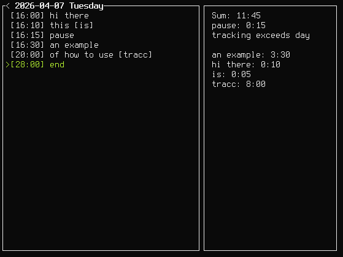

# tracc

tracc is a small terminal app for tracking work time by day and task.
It keeps a running timesheet, shows totals, and lets you edit entries quickly from the keyboard.



## Features

- Daily time tracking
- Per-task duration summary
- Pause time summary
- Add, edit, remove, copy, and paste entries
- Undo and redo for recent changes
- Navigate across days and jump back to today
- Mouse selection support
- Local data is stored in the user data directory
- Minimal (read: no) configuration with "smart defaults"

## Usage

Run it with:

```bash
cargo run
```

Build it with:

```bash
cargo build
```

tracc is written in Rust and uses ratatui.
It supports Linux, macOS, and Windows,
but only Linux has been tested.

## Key bindings

### Normal mode

- `q` quit
- `j` / `k` move selection down / up
- `G` jump to the first entry
- `g g` jump to the last entry
- `g t` jump to today
- `J` go to the next day
- `K` go to the previous day
- `o` create a new entry at the current time
- `a` edit the selected entry text
- `i` edit the selected entry text from the start
- `A` edit the selected entry time
- `I` edit the selected entry time from the start
- `r` edit the selected entry text with an empty field
- `R` edit the selected entry time with an empty field
- `-` move the selected time back by five minutes
- `+` move the selected time forward by five minutes
- `d` delete the selected entry
- `y y` copy the selected entry
- `p` paste the copied entry
- `u` undo
- `Ctrl+r` redo
- `Space` no action

### Edit mode

- `Enter` save
- `Esc` cancel
- `Backspace` delete the previous character
- `Delete` delete the next character
- `Ctrl+Backspace` delete the previous word
- `Ctrl+Delete` delete the next word
- `Left` / `Right` move by character
- `Ctrl+Left` / `Ctrl+Right` move by word
- `Home` / `End` jump to start / end

### Confirmation dialogs

- `y` or `Enter` confirm
- `n` or `Esc` cancel
- `Left` / `Right` / `Tab` / `Shift+Tab` switch between yes and no

## Advanced usage tips

- Pause entries are grouped under `pause`.
  `pause`, `lunch`, `break`, and `end`
  all count toward the pause summary.
- If you enter text like `random text [group]`,
  tracc uses `group` for the summary
  instead of the full text.
- Time can exceed the calendar day up until +24 hours.
